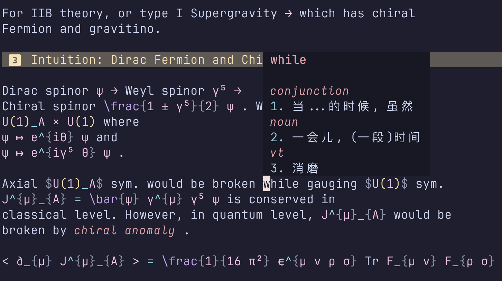
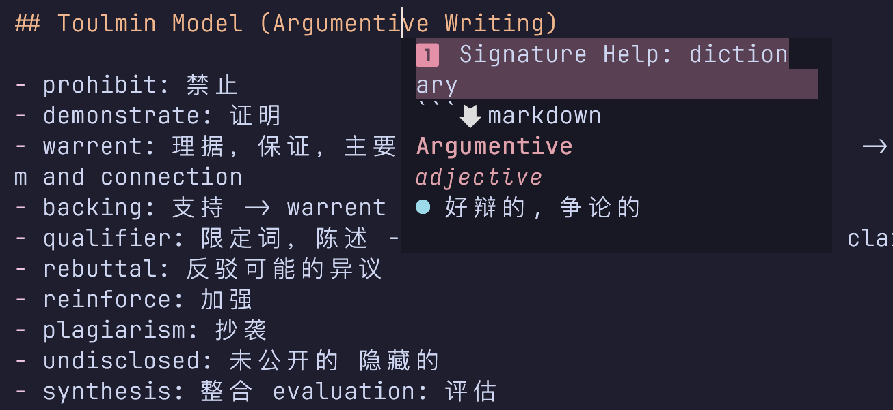

# Dictionary LSP
<div align="center">

[English Document](./readme/en.md) | [中文文档](./README.md)

</div>

基于 LSP 语言服务器与`rust`的快速字典与英文输入法实现。

## 介绍

<div align="center">
  
</div>

<div align="center">
  
</div>

Dictionary LSP 是一个使用 `rust` 编写的、基于 LSP 协议的字典查询工具，可以使用`textDocument/hover` 和 `textDocument/signatureHelp`帮助你在 neovim 等支持 LSP 协议的编辑器中快速查询单词释义，使用`texDocument/CompletionItem` 实现带简单 fuzzy matcher 的自动补全 (受到[blink-cmp-dictionary](https://github.com/Kaiser-Yang/blink-cmp-dictionary)的启发，但现在反应比较迟钝，并且需要强化模糊匹配的速度与精度)。

__试试看！__ 当前主流的编辑器都具有极为简单的 LSP 支持，基于 LSP 的插件将会帮助你在一定程度上摆脱对编辑器插件的依赖，以编辑器的原生方式查询单词释义 (这通常是最为符合直觉的！)。

这是一个随作者成长会不断更新的项目，之后会基于 LSP 的特性更新更多的功能😆

## 安装、使用与配置

直接 clone 本项目，然后使用 `cargo build --release` 编译即可。我们没有提供任何字典文件，你需要从其他地方下载，然后转换为形如
  
  ```json
  "passion": {
    "noun": [
      "激情，酷爱，热爱，强烈感情，耶稣受难 (故事)"
    ]
  }
  ``` 
的结构即可。将这个文件放置在 `~/dicts/dictionary.json` 中 (这是默认的字典存储位置) 即可完成配置。由于 JSON 文件解析所需的 IO 性能较差 (因此没有实现对 JSON 字典源的模糊查找支持)，我们也提供了 SQLite 数据库的支持，你可以将字典转换为 SQLite 数据库，然后放置在 `~/dicts/dictionary.db` 中即可。转换方式可以参考[#1](https://github.com/pxwg/dictionary_lsp/issues/1)。

如果你想要配置预览样式、字典路径等内容，可以参考 (这些不一定是默认配置)
```toml
# ~/.config/dictionary_lsp/config.toml
dictionary_path = "/path/to/your/dictionary.json" # JSON supported dictionary
freq_path = "/path/to/your/freq.db" # frequency database for auto completion and fuzzy search ordered by frequency
# dictionary_path = "/path/to/your/dictionary.db" # SQLite supported dictionary
[formatting]
word_format = "**{word}**"
part_of_speech_format = "*{part}*"
definition_format = "{num}. {definition}"
example_format = "> *{example}*"
add_spacing = true
[completion]
max_distance = 2 # Maximum distance for fuzzy search
enabled = true
# TODO: better fuzzy search algorithm and more configurations
```
其中`{}`中的内容会被传递到变量之中。

不同的客户端有不同的配置 LSP 方法，以[neovim](https://github.com/neovim/neovim) 为例，在配置了[nvim-lspconfig](https://github.com/neovim/nvim-lspconfig) 的前提下，可以参考
```lua
      local configs = require("lspconfig.configs")
      local lspconfig = require("lspconfig")
      if not configs.dictionary then
        configs.dictionary = {
          default_config = {
            filetypes = { "markdown" },
            cmd = { vim.fn.expand("$HOME/dictionary_lsp/target/release/dictionary_lsp") },
            root_dir = function(fname)
              local startpath = fname
              return vim.fs.dirname(vim.fs.find(".git", { path = startpath, upward = true })[1]) or vim.fn.getcwd()
            end,
          },
        }
      end

      -- Then set it up
      lspconfig.dictionary.setup({})
```  
放在你的 `init.lua` 中即可使用。其他的编辑器请参考对应的 LSP 插件的配置方法。

你可以向 LSP 发送`textDocument/executeCommand`命令`dictionary.enable_cmp`以控制不利于快速查询的配置，例如关闭自动补全等。如果你有一个非常快速的 LSP 源并且不希望在自动补全时被本 LSP 阻碍，可以善用这一命令来调和字典查询与快速补全的冲突。

## 参考数据源

我们有意不提供字典数据源，因为这是一个非常大的数据集，我们不希望在项目中包含这些数据。如果你需要字典数据源，可以参考以下数据源 (他们都是 MIT licence)：

- [ECDICT](https://github.com/skywind3000/ECDICT) 提供 csv 数据库，包含大量不同词性的单词释义，需要自行转换为 json 或者 sqlite 数据库。注意这个数据源有很多非单词的数据，目前还不能实现对类似短语的结构查找。之后会实现这个功能 (见)；
- [Natural Language Corpus Data: Beautiful Data](https://norvig.com/ngrams/) 提供了单词与词频的对应关系，作为一个小规模数据库可以用来实现自动补全和索引，给定的词频被用于在 sqlite 数据库查找时加权。

## TODO

这是我想做的一些事，特别想做的会标上⭐。如果你有什么想法或者建议，欢迎提 issue 或者 pr。

- [x] 基本的单词查询功能
- [x] 自定义 textDocument/hover 请求的返回文本格式⭐
- [x] 支持 textDocument/signatureHelp 请求⭐
- [x] 模糊查找 (初步完成，之后会基于更为流行的模糊匹配库，但这同样依赖于 SQLite 的实现)  
- [ ] 语法纠错⭐⭐(特别想实现！但是暂时还不知道要怎么做)
- [ ] 自动补全⭐(现在实现了基于*词频*与*tire 树*的自动补全，代价是一个额外的 SQLite 数据库。通过小型库拿空间换时间)
    - [ ] 增加更符合直观的自动补全模式，包括
        - [x] 大小写匹配
        - [x] 词根匹配
        - [ ] 超越词频搜索的模糊匹配
- [ ] 添加单元测试⭐(特别想做，但可能会需要重构一下代码，抽象一下具体的业务逻辑)
    - [ ] Hover
    - [ ] SignatureHelp
    - [x] Completion (这个是大头，所有我们首先实现之)
- [ ] 添加更多的字典数据源⭐
- [x] 配置文件指定字典位置
- [x] 支持 SQLite 数据库⭐
- [ ] 短语查找
- [ ] 支持 csv 等格式的字典转换
- [x] 更强大的模糊匹配算法⭐(目前实现了 SIMD 加速和 tire 树两套解决方案，后者依赖于`tire_rs` 库，前者是自己维护的一个小算法，在简单的 benchmark 中都维持 `10 us` 的响应速度 (`333333`词，`M3` 芯片)，符合实际补全的需求)
- [ ] 实现 neovim 的兼容层，实现在文件编辑时主动添加生词、统计查询频率并调用等功能 (强烈依赖于 SQLite 的实现)⭐⭐⭐(特别想做！但是工程量有点大)

## 背景

作为一个英语词汇量完全不够支撑个人英语阅读需求的英语苦手，一直以来我都很希望能够实现在 neovim 记录英语笔记时可以实现单词的快速查询。这样一方面可以帮助我在写作笔记的时候快速了解英文释义 (例如，在英语课上同步记录笔记，或者进行文献阅读时，我可以将收听到的单词直接拿去搜索)，另一方面可以在阅读文档时 (多数都是 md 格式，一般采用 neovim 阅读) 减少词汇障碍。

在用 neovim 写代码的时候，LSP 自带的 `textDocument/hover` 请求可以帮助我快速调用 LSP 实现函数 / 变量名的查询 (在 neovim 中默认使用 `K` 命令调用)，这启发我使用 LSP 实现字典功能，用统一的方法像查询变量名一样去查询单词的定义。而在 neovim 的 insert 模式下，则可以用 `textDocument/signatureHelp` 功能实现对变量名的查询 (在 neovim 中默认使用 `<C-S>` 调用)，这同样也可以帮助我在写作的过程中实现单词定义的查询。这两个功能很好地模拟了我们对单词的查询心智模式，并很容易嵌入到兼容 LSP 编辑器的工作流中。同时，简单的自动补全功能可以帮助我更好处理书写时的单词查询和拼写问题，并实现简单的查询词典功能。

这个功能整体比较容易实现，因此尝试使用 rust 编写来熟悉一下 rust 的开发流程。
