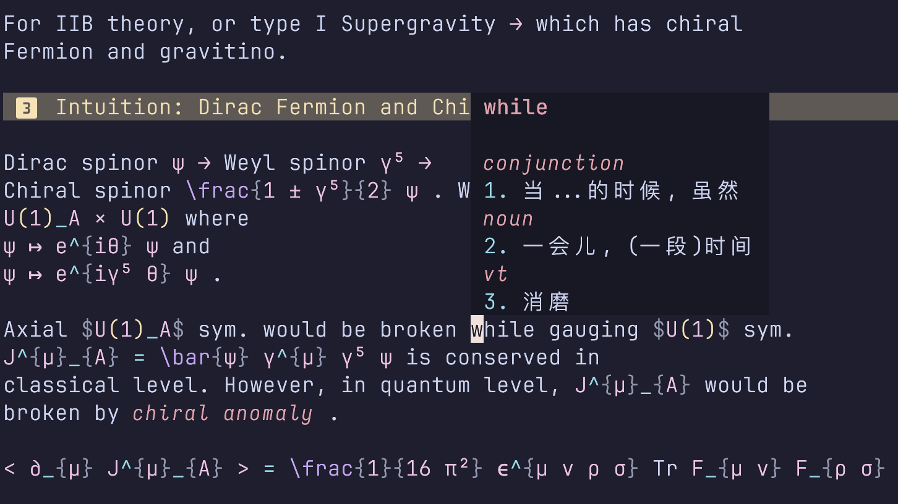

# Dictionary LSP

自用的字典查询系统，基于 LSP 语言服务器与`rust`实现。

## 介绍

<div align="center">
  
</div>

Dictionary LSP 是一个使用 `rust` 编写的、基于 LSP 协议的字典查询系统，可以使用`textDocument/hover`帮助你在 neovim 中快速查询单词释义。这是一个随作者成长会不断更新的项目，之后也许会基于 LSP 的特性更新更多的功能😆

## 安装、使用与配置

直接 clone 本项目，然后使用 `cargo build --release` 编译即可。我们没有提供任何字典文件，你需要从其他地方下载，然后转换为形如
  
  ```json
  "passion": {
    "noun": [
      "激情，酷爱，热爱，强烈感情，耶稣受难 (故事)"
    ]
  }
  ``` 
的结构即可。将这个文件放置在 `$HOME/dicts/dictionary.json` 中即可完成配置。(这是目前的处理方式，之后会采用配置文件指定字典位置，实现对 csv 等格式的字典转换等功能，并且会在之后支持 SQLite 数据库，这样查询速度更快，现在本人的词库有 160 万 + 行 JSON，解析的时间大约半秒)

如果你想要配置预览样式、字典路径等内容，可以参考 (这些不一定是默认配置)
```toml
dictionary_path = "/path/to/your/dictionary.json"
[formatting]
word_format = "**{word}**"
part_of_speech_format = "*{part}*"
definition_format = "{num}. {definition}"
example_format = "> *{example}*"
add_spacing = true
```
其中`{}`中的内容会被传递到变量之中。

不同的客户端有不同的配置 LSP 方法，以[neovim](https://github.com/neovim/neovim) 为例，在配置了[nvim-lspconfig](https://github.com/neovim/nvim-lspconfig) 的前提下，可以参考
```lua
      local configs = require("lspconfig.configs")
      local lspconfig = require("lspconfig")
      if not configs.dictionary then
        configs.dictionary = {
          default_config = {
            filetypes = { "markdown" },
            cmd = { vim.fn.expand("$HOME/dictionary_lsp/target/release/dictionary_lsp") },
            root_dir = function(fname)
              local startpath = fname
              return vim.fs.dirname(vim.fs.find(".git", { path = startpath, upward = true })[1]) or vim.fn.getcwd()
            end,
          },
        }
      end

      -- Then set it up
      lspconfig.dictionary.setup({})
```  
放在你的 `init.lua` 中即可使用。

## TODO

这是我想做的一些事，特别想做的会标上⭐。如果你有什么想法或者建议，欢迎提 issue 或者 pr。

- [x] 基本的单词查询功能
- [x] 自定义 textDocument/hover 请求的返回文本格式⭐
- [ ] 支持 textDocument/signatureHelp 请求⭐
- [ ] 模糊查找⭐
- [x] 配置文件指定字典位置
- [ ] 支持 SQLite 数据库
- [ ] 支持 csv 等格式的字典转换
- [ ] 实现 neovim 的兼容层，实现在文件编辑时主动添加生词、统计查询频率并调用等功能 (强烈依赖于 SQLite 的实现)⭐

## 背景

作为一个英语词汇量完全不够支撑个人英语阅读需求的英语苦手，一直以来我都很希望能够实现在 neovim 记录英语笔记时可以实现单词的快速查询。这样一方面可以帮助我在写作笔记的时候快速了解英文释义 (例如，在英语课上同步记录笔记，或者进行文献阅读时，我可以将收听到的单词直接拿去搜索)，另一方面可以在阅读文档时 (多数都是 md 格式，一般采用 neovim 阅读) 减少词汇障碍。

在用 neovim 写代码的时候，LSP 自带的 `textDocument/hover` 请求可以帮助我快速调用 LSP 实现函数 / 变量名的查询 (在 neovim 中使用`K`命令调用)，这启发我使用 LSP 实现字典功能，用统一的方法像查询变量名一样去查询单词的定义。

这个功能整体比较容易实现，因此尝试使用 rust 编写来熟悉一下 rust 的开发流程。
